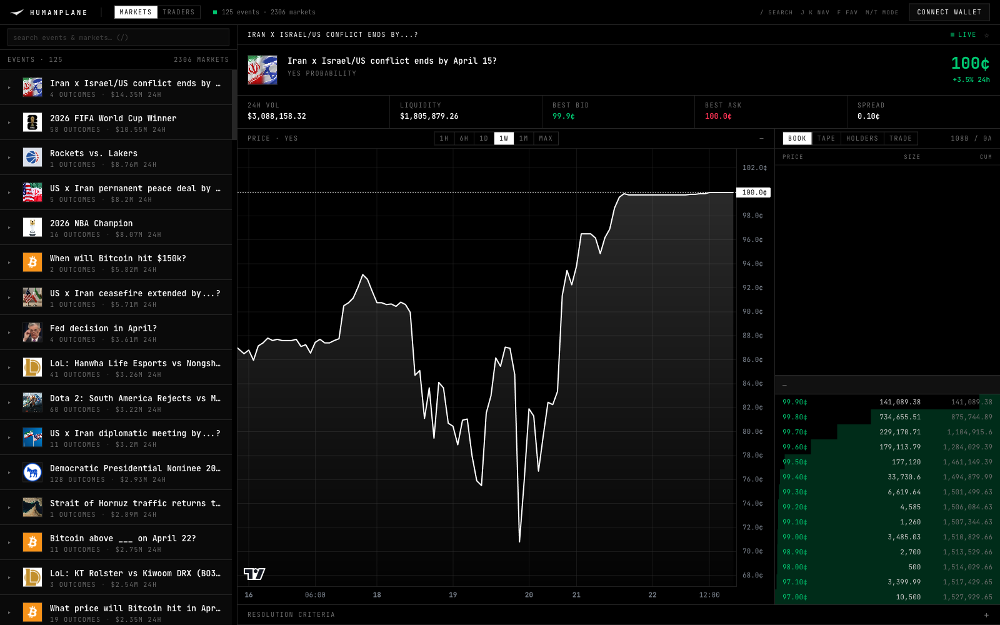

# humanplane

A **self-hosted Polymarket trading terminal** — Bloomberg-style dark UI,
sub-second order book via SSE, full trader leaderboard drill-down, and
self-custodial order execution with no third-party relayer.



> Browse 10,000+ markets, watch the order book tick in real time, sign
> orders with MetaMask. Everything you can do on polymarket.com, plus
> keyboard navigation and a proper trader view. No custody, no backend
> secrets, no "Builder" credentials.

---

**Contents**

- [Why this exists](#why-this-exists)
- [Features](#features)
- [Quick start](#quick-start)
- [Connecting a wallet & trading](#connecting-a-wallet--trading)
- [Architecture](#architecture)
- [Environment variables](#environment-variables)
- [Keyboard shortcuts](#keyboard-shortcuts)
- [Troubleshooting](#troubleshooting)
- [Security model](#security-model)
- [Known limitations](#known-limitations)
- [License](#license)

---

## Why this exists

Polymarket's UI is designed for casual users. If you want to:

- Scan thousands of events quickly with search and `j`/`k` navigation
- Watch a market's order book tick in real time (SSE + rAF-throttled)
- Drill through any trader's full position history (open / closed / trades / activity)
- See top holders on any market and click straight into their profile
- Execute trades without leaving a dense, keyboard-driven interface

...the stock UI is the wrong tool. This is an independent third-party client
that reuses Polymarket's own public APIs (Gamma, CLOB, Data) and lets you do
everything above from one screen.

**Read-only mode works without a wallet.** Browsing, searching, live book,
leaderboard, trader drill-down — no signature required.

**Trading mode is self-custodial.** Connect MetaMask → the terminal signs
orders directly against Polymarket's CLOB. Your keys never leave the
browser. The backend proxies to Polymarket's REST/WebSocket surfaces but
never touches wallet material.

## Features

### Markets view
- **10,000+ active markets** loaded via infinite scroll with debounced
  full-text search (hits Polymarket's `/public-search` endpoint)
- **Collapsible events** — each expands to its outcome markets with live
  prices and 24h deltas
- **Live order book** via SSE — backend holds one WebSocket to Polymarket's
  market channel per viewer, filters by `asset_id`, fans out over SSE.
  Client applies deltas via binary-search insert/delete on sorted arrays.
- **Live-ticking price chart** — appends from `last_trade` events, falls
  back to mid-of-book on quiet markets
- **Right-pane tabs**: Book · Tape · Holders · Trade
  - *Tape* — recent trades for the market (polled)
  - *Holders* — top YES/NO holders, click-through to trader profile
  - *Trade* — wallet-gated order placement (see below)
- **Interval selector** for the chart: 1H / 6H / 1D / 1W / 1M / MAX
- **Favorites** (`f` hotkey) — stars pin the event to the top, persisted in
  `localStorage`, synced across tabs via the `storage` event

### Traders view
- **Leaderboard** of up to 1,000 traders with infinite scroll
- Filter by **period** (1D / 1W / 1M / ALL) × **metric** (PnL / Volume)
- Click a trader → tabbed detail: **Open · Closed · Trades · Activity**
- **Click-through**: any position row navigates to that market
- **Deterministic identicons** for traders without profile pictures

### Wallet / trading (optional)
- **Connect MetaMask** — derive your Polymarket Safe via CREATE2 on connect
- **"View my positions"** — drops you into the Trader view pre-filtered to
  your Safe (live PnL, positions, trades)
- **Two trading modes, user-selectable:**
  - **EOA mode** (default when USDC is on your EOA): signer == funder == EOA.
    Direct approvals via `USDC.approve` + `CTF.setApprovalForAll`. Up to
    6 approval txs, each ~$0.01 MATIC.
  - **Safe mode** (for users onboarded via polymarket.com): signer == EOA,
    funder == your Polymarket Safe. Approvals go through the Safe via a
    single MultiSend `execTransaction` using a pre-validated signature.
    If the Safe isn't deployed, we deploy it first (2 txs total, ~0.2 MATIC).
- **Order form**: outcome toggle, BUY/SELL, price (auto-snapped to tick
  size), size, post-only. Live USDC allowance shown.
- **Open orders** list + cancel, polled every 10 seconds
- **Error translation** — CLOB rejection codes remapped to friendly copy
  ("Size below this market's minimum", "Price isn't a multiple of this
  market's tick size", etc.)

### Plumbing
- **URL routes**: `/market/:slug`, `/trader/:addr` — refresh-safe, shareable
- **Global keyboard shortcuts** (see table below)
- **Cross-tab favorite sync** via `storage` events
- **Skeleton loaders** for initial state on every major panel

## Quick start

### Requirements
- **Rust** 1.88+ (`rustup install stable && rustup default stable`)
- **Node** 20+ (lts recommended)
- *(Optional for trading)* **MetaMask** on Polygon mainnet

### Run in development

```bash
# Terminal 1 — backend (port 8080)
cd backend && cargo run --release

# Terminal 2 — frontend (port 5173/5174)
cd frontend && npm install && npm run dev
```

Open <http://localhost:5174>.

First `cargo run --release` compiles the entire dependency tree (polyoxide
pulls in alloy + rustls, so it's ~2 minutes the first time). Subsequent
builds are seconds.

### Production build

```bash
# Backend — single static binary
cd backend && cargo build --release
# → backend/target/release/polymarket-terminal

# Frontend — static assets
cd frontend && npm ci && npm run build
# → frontend/dist/
```

Frontend `dist/` can be served by any static host (Caddy, Nginx, Netlify,
Cloudflare Pages). Backend binary can be deployed to anything that runs
Linux x86_64 / aarch64. See [Environment variables](#environment-variables)
for split-origin deployments.

## Connecting a wallet & trading

**If you've never used Polymarket before** (you're a fresh EOA):

1. Get some USDC.e (`0x2791Bca1f2de4661ED88A30C99A7a9449Aa84174`) and ~0.3
   MATIC on **Polygon mainnet** (not Ethereum, not Polygon zkEVM — this
   catches most users). Any bridge or on-ramp works.
2. Click **Connect Wallet**. Approve in MetaMask. If you're not on Polygon,
   we'll prompt a switch.
3. Open any market → **Trade** tab.
4. Mode defaults to **EOA**. If your USDC is on the EOA directly, leave it.
5. Click **Initialize Trading**. MetaMask will prompt for each approval tx
   (up to 6: 3× USDC spending + 3× CTF operator). Each is a few cents in MATIC.
6. Place an order. First-ever order triggers two MetaMask prompts: one to
   derive L2 API credentials (cached locally, never again), one to sign
   the actual order.

**If you already use polymarket.com**:

1. Connect the same MetaMask account you use there.
2. Open Trade tab → flip the **Funds on** toggle to **Safe**.
3. Polymarket's UI already set up your Safe + approvals, so no init needed.
4. Place orders. First order prompts creds + order sig; subsequent orders
   prompt for the order only.

The toggle is keyed per-session; your preference persists in `localStorage`.

## Architecture

### Backend (Rust + axum)

A thin typed proxy that wraps [polyoxide](https://github.com/dilettante-trading/polyoxide)
— the unified Rust SDK for Polymarket's Gamma + CLOB + Data APIs.

```
┌──────────────┐   ┌──────────────┐   ┌─────────────────────┐
│  Browser     │←─→│  axum :8080  │←─→│  Polymarket APIs    │
│  (Solid SPA) │   │              │   │  + CLOB WebSocket   │
└──────────────┘   └──────────────┘   └─────────────────────┘
        ↑                                        │
        └───── SSE: /api/stream/:tokenId ────────┘
```

- Read endpoints (`/markets`, `/events`, `/book`, `/history`, `/trades`,
  `/holders`, `/leaderboard`, `/user/:addr/*`) are thin JSON passthroughs.
- `/api/stream/:tokenId` is a Server-Sent Events endpoint. The backend
  spawns a `tokio` task that holds a Polymarket WebSocket, filters messages
  by `asset_id`, and fans them out over SSE. Reconnects with exponential
  backoff up to 20 attempts; emits a `done` event on giveup so the
  browser's `EventSource` stops auto-reconnecting.
- Every path / query param passes through `ensure_id()` — alphanumeric +
  `-`/`_` only, bounded length. `limit` on every paginated endpoint is
  clamped with `.min(N)`.
- `rustls` with the `ring` provider explicitly installed at startup
  (polyoxide's WS client requires a `CryptoProvider`).
- `tower-http::TimeoutLayer(20s)` on every route.

### Frontend (SolidJS)

Single-page app rendered into `#root`. Router from `@solidjs/router`; no SSR.

- **State**: TanStack Query for server state, `createSignal` for UI state,
  `localStorage` for favorites + wallet + cached L2 credentials.
- **Live order book** (`src/lib/stream.ts`): subscribes to the backend
  SSE, maintains sorted bid/ask arrays, binary-search insert/delete on
  price-change deltas. Publishes on `requestAnimationFrame` with a
  `disposed` guard so rAF can't fire into a torn-down reactive scope.
- **Chart** (`src/components/PriceChart.tsx`): lightweight-charts area
  series with `autoSize: true`. `props.liveTick` is read reactively; each
  new tick calls `series.update({time, value})`.
- **Wallet** (`src/lib/wallet.ts`): viem-based. No wagmi. Uses raw
  `window.ethereum` (EIP-1193) + viem's `createWalletClient`. Trading
  mode (`eoa` / `safe`) persisted per-wallet.
- **Trading** (`src/lib/polymarket.ts`): `@polymarket/clob-client` with a
  hand-written ethers-compat signer shim over viem. L2 credentials scoped
  by `(eoa, funder, sigType)` and cached. `useServerTime: true` to avoid
  clock-skew 401s.
- **In-app Safe deploy + approvals** (`src/lib/safeSetup.ts`):
  EIP-712 `CreateProxy` for the factory tx, then Safe `execTransaction`
  with a pre-validated type-0x01 signature batching 7 inner calls via
  MultiSendCallOnly v1.3.0. No Polymarket Builder credentials needed.

## Environment variables

All optional. Sensible defaults for local dev.

### Backend
| Var | Default | Purpose |
|---|---|---|
| `HOST` | `127.0.0.1` | Bind address. Set to `0.0.0.0` behind a reverse proxy. |
| `PORT` | `8080` | Bind port. |
| `RUST_LOG` | `info` | Standard `tracing-subscriber` env filter. |

### Frontend (prefix `VITE_` so Vite exposes them)
| Var | Default | Purpose |
|---|---|---|
| `VITE_API_BASE` | `""` (same origin) | URL prefix for `/api/*` calls. Set when backend is on a different origin (e.g. `https://api.example.com`). Must not include trailing slash. |
| `VITE_POLYGON_RPC_URL` | viem's public Polygon RPC | Explicit Polygon RPC for on-chain reads (USDC balance, allowances, Safe bytecode). Strongly recommended in production — the public RPC rate-limits aggressively. Any Alchemy/Infura/QuickNode URL works. |

Example `.env` at `frontend/.env.local`:
```
VITE_API_BASE=https://api.yourdomain.com
VITE_POLYGON_RPC_URL=https://polygon-mainnet.g.alchemy.com/v2/...
```

## Keyboard shortcuts

| Key | Action |
|---|---|
| `/` | Focus search |
| `j` · `k` | Next / previous row in sidebar |
| `m` · `t` | Switch to **M**arkets / **T**raders mode |
| `f` | Toggle favorite on current selection |
| `Esc` | Blur focused input |

## Troubleshooting

**"This trade needs $X more USDC approved"** — You're looking at a stale
allowance state. Click **Initialize Trading** to run the approval ceremony,
then retry. In EOA mode this is one tx per missing spender; in Safe mode
it's a single MultiSend tx.

**"Your Polymarket Safe isn't deployed yet"** (Safe mode, fresh users) —
Click the same **Initialize Trading** button. It deploys the Safe and runs
all 7 approvals. Requires ~0.3 MATIC on your EOA.

**"You have 0 MATIC on your EOA"** — Bridge ~$0.50 of MATIC to **Polygon
mainnet**. Most common trap: sending MATIC to Ethereum mainnet or Polygon
zkEVM instead. The chain ID must be `137`.

**"Server clock skew — please retry"** — Your system clock is >30s off
from wall time. macOS: System Settings → General → Date & Time → "Set
time automatically". We now use `useServerTime: true` which should
normally work around this, but if you see this error your clock is far
enough off that even the server-time request failed.

**MetaMask keeps asking to sign** — The L2 credential derivation is
scoped by `(eoa, funder, sigType)`. If you flip the EOA/Safe toggle, a
new derivation happens (one sig per unique mode). Stays cached after.
Polling queries are gated so they never trigger a sig.

**Order rejected with "Price isn't a multiple of this market's tick
size"** — Every market has an `orderPriceMinTickSize` (usually 0.01,
sometimes 0.001 or 0.0001). We pre-fetch it from the CLOB and snap your
price on submit, but if you see this error the tick changed since your
last fetch. Retry.

**Order rejected with "order crossed"** — You're submitting a bid above
the best ask (or ask below best bid) with `post-only` on. Either uncheck
post-only, or set your price within the spread.

## Security model

- **No private key ever leaves the browser.** Every signature — credential
  derivation, Safe deployment, approvals, order signing — is an EIP-712
  message signed by MetaMask. viem constructs the calldata; MetaMask
  shows the user what they're signing.
- **No backend secrets.** The Rust service proxies public Polymarket
  endpoints. It does not hold Builder credentials, relayer keys, or
  wallet material. You could run it behind an anonymous VPN and it would
  work identically.
- **No third-party relayer.** Some integrations use Polymarket's gasless
  relayer (which requires Builder credentials). This one doesn't — you
  pay your own Polygon gas directly from your EOA (a fraction of a cent
  per approval).
- **Approvals are user-initiated.** The "Initialize Trading" button is
  explicit about what's happening — which txs, what cost, whether your
  Safe is being deployed. No hidden auto-approvals. Values are `MaxUint256`
  to match polymarket.com's behavior.
- **CORS**: backend defaults to `CorsLayer::permissive()` (no credentials).
  Fine for personal / self-hosted use. Tighten for multi-tenant deploys.

## Known limitations

- **Market orders (FOK/FAK)** — SDK wiring is in place but the order form
  UI only emits GTC limits right now.
- **Position redemption** — not implemented. For resolved markets, use
  polymarket.com to claim winnings.
- **Compare traders side-by-side** — not implemented.
- **Multi-outcome chart overlay** — events with many outcomes (e.g. "2028
  Democratic nominee") show one outcome at a time; no combined chart.
- **Wallet support** — tested on MetaMask. Coinbase Wallet / Rabby /
  Brave Wallet should work via EIP-1193 but aren't exercised.
- **Mobile layout** — built for desktop. Readable on tablet, cramped on
  phone.
- **Chart interval granularity** — live tick appends at 1s precision;
  lightweight-charts snaps to the interval you've selected. Re-select the
  interval to flush the live tail back into the fetched data.

## License

[MIT](./LICENSE) · © 2026 Nikshep SVN

---

**Not affiliated with Polymarket, Inc.** This is an independent third-party
client reusing public endpoints. Trade at your own risk. Prediction markets
can go to zero.
